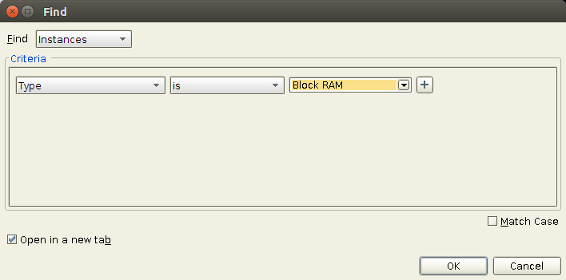
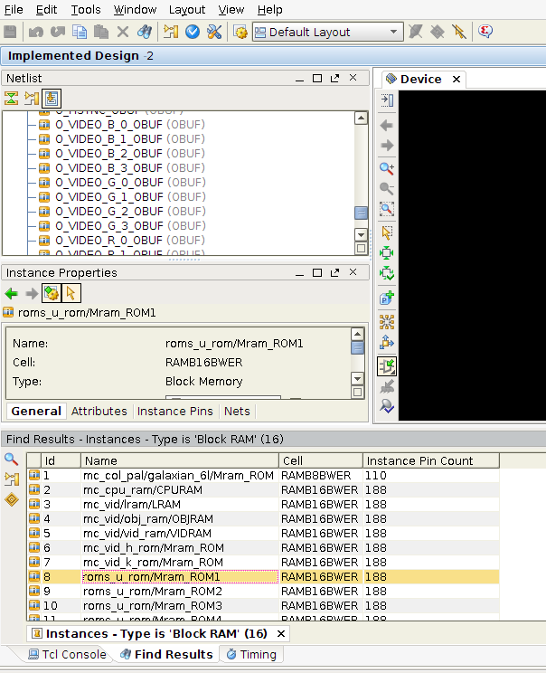

Find BRAM in NetList

1. Open **PlanAhead 14.7**

2. Edit -> Find. Select **Block RAM**.

3. Result.

Xilinx use / or _ in the netlist path ...

roms_u_rom/Mram_ROM1

mc_col_pal/galaxian_6/Mram_ROM

