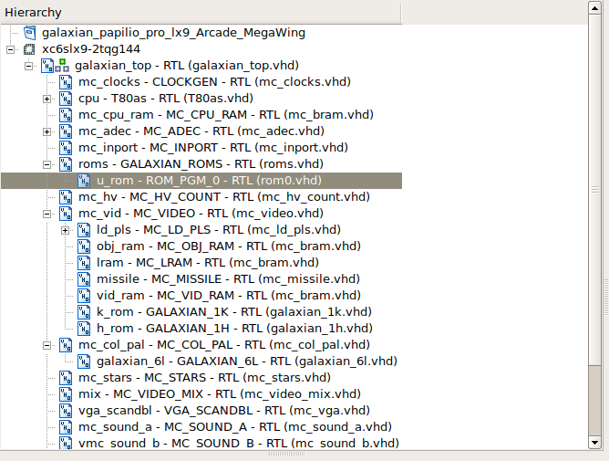

Find BRAM in NetList

1. Open **PlanAhead 14.7**

2. Edit -> Find. Select **Block RAM**.

3. Result.

Xilinx use  **/** or **_** in the netlist path.

Sample:

*roms_u_rom/Mram_ROM1*

*mc_col_pal/galaxian_6/Mram_ROM*

**ISE Hierarchy**

**galaxian.bmm**

	ADDRESS_MAP avrmap PPC405 0

		ADDRESS_SPACE ROM_PGM_0 RAMB16 [0x00000000:0x00003fff]
		    BUS_BLOCK
			   roms_u_rom/Mram_ROM1 [7:0];
		    END_BUS_BLOCK;
			  
		    BUS_BLOCK
			   roms_u_rom/Mram_ROM2 [7:0];
		    END_BUS_BLOCK;

		    BUS_BLOCK
			   roms_u_rom/Mram_ROM3 [7:0];
		    END_BUS_BLOCK;

		    BUS_BLOCK
			   roms_u_rom/Mram_ROM4 [7:0];
		    END_BUS_BLOCK;		  

		    BUS_BLOCK
			   roms_u_rom/Mram_ROM5 [7:0];
		    END_BUS_BLOCK;
			  
		    BUS_BLOCK
			   roms_u_rom/Mram_ROM6 [7:0];
		    END_BUS_BLOCK;

		    BUS_BLOCK
			  roms_u_rom/Mram_ROM7 [7:0];
		    END_BUS_BLOCK;

		    BUS_BLOCK
			  roms_u_rom/Mram_ROM8 [7:0];
		    END_BUS_BLOCK;	
			  
		END_ADDRESS_SPACE;
		  
		  
		ADDRESS_SPACE GALAXIAN_1H RAMB16 [0x00000000:0x000007ff]
		    BUS_BLOCK
			mc_vid_h_rom/Mram_ROM [7:0];
		    END_BUS_BLOCK;
			  
		END_ADDRESS_SPACE;	

		ADDRESS_SPACE GALAXIAN_1K RAMB16 [0x00000000:0x000007ff]
		    BUS_BLOCK
			mc_vid_k_rom/Mram_ROM [7:0];
		    END_BUS_BLOCK;
			  
		END_ADDRESS_SPACE;	

		ADDRESS_SPACE galaxian_6l RAMB16 [0x00000000:0x000007ff]
		    BUS_BLOCK
			mc_col_pal/galaxian_6l/Mram_ROM [7:0];
		    END_BUS_BLOCK;
			  
		END_ADDRESS_SPACE;		 

	END_ADDRESS_MAP;
